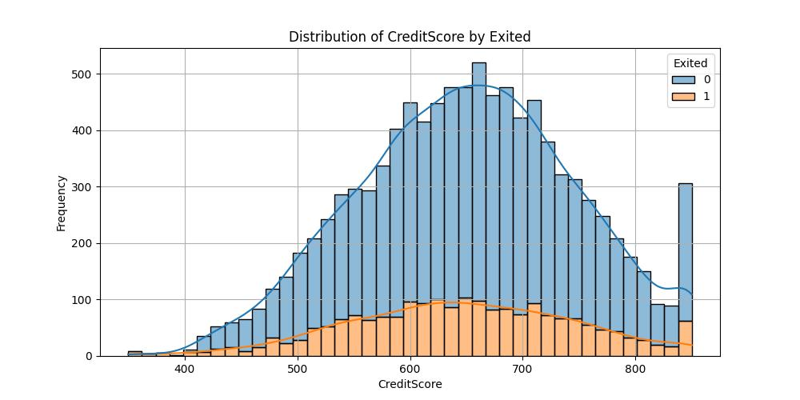

# 📈 Bank Churning Data Analysis

## 🔍 Overview
This project focuses on analyzing the Bank Churning Dataset through Data Cleaning, Exploratory Data Analysis (EDA), and Data Visualization using Python. It highlights customer churn trends, data distributions, and visualizes key factors influencing churn. Additionally, it includes the development of Linear Regression and Logistic Regression models for predictive analysis..

## 📊 Tools Used
- Python (Pandas, NumPy, Matplotlib, Seaborn, Scikit-learn)
- Visual Studio Code (VS Code)
- Sample CSV Dataset 

## 🎯 Features
- Comprehensive data distribution analysis with charts and graphs
- Historical churn trend analysis. 
- Insights into account activities: Balance, Tenure, Product Usage. 
- Visualization of key churn prediction factors. 
- Linear and Logistic regression modeling for predictive insights.

## 📂 Structure

BankChurningDataAnalysis/
│
├── README.md
├── BankChurningDataAnalysis/
│   └── BankChurningDataAnalysis.py  
├── Data/
│   └── bank_churn_modeling.csv
├── Images/
│   └── Various Charts and Graphs.png

## 🖼 Graphs and Charts Preview

## 📌 How to Use
1. Clone this repo or download the `.py` file.
2. Open it in VS Code Desktop.
3. Explore the visuals or connect your own data.

## 📬 Contact Author
Created by [Usha Topagi]  
