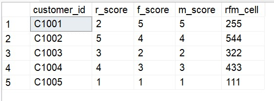

# 📊 Advanced SQL for Strategic Business Intelligence: GlobalMart Star Schema
## Business Scenarios & Advanced SQL Solutions

### Scenario 1: Customer RFM Segmentation

#### Business Problem: 
The Marketing team wants to segment customers based on Recency (how recently they bought), Frequency (how often they buy), and Monetary (how much they spend) values to create targeted campaigns.

#### Solution Steps:
1. Calculate Recency, Frequency, and Monetary values for each customer using a CTE.
    # Recency, Frequency, and Monetary (RFM) are used to analyze customer value.
        a. Recency: How recently a customer made a purchase (e.g., days since last purchase).
        b. Frequency: How often a customer makes a purchase (e.g., number of purchases in a period).
        c. Monetary: How much money a customer spends (e.g., total value of purchases).
2. Use the NTILE(5) window function to assign a score from 1 to 5 for each metric.
    NTILE(5) divides the rows in a dataset into 5 equal groups (tiles) and assigns a rank from 1 to 5 to each row based on the group it falls into. It's used to distribute scores evenly, so the lowest values get a rank of 1, and the highest get a rank of 5.
3. Concatenate the scores to create an RFM cell.

---
#### SQL Query

WITH RFM_Base AS (
    SELECT 
        customer_id,
        COUNT(DISTINCT(transaction_id)) AS frequency,
		MAX(fs.date_id) AS max_date,
        SUM(total_sales) AS monetary
    FROM fact_sales fs
    JOIN dim_date d ON fs.date_id = d.date_id
    GROUP BY customer_id
),
RFM_Scores AS (
    SELECT 
        customer_id,
        NTILE(5) OVER (ORDER BY max_date ASC) AS r_score,
        NTILE(5) OVER (ORDER BY frequency ASC) AS f_score,
        NTILE(5) OVER (ORDER BY monetary ASC) AS m_score
    FROM RFM_Base
)
SELECT 
    customer_id,
    r_score, f_score, m_score,
    CONCAT(r_score, f_score, m_score) AS rfm_cell
FROM RFM_Scores
ORDER BY customer_id
--LIMIT 5;

---

---

####  Thanks for visiting here - Happy Learning ####
