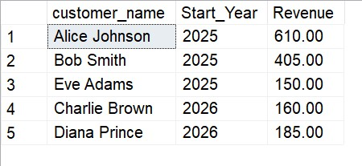

# 📊 Advanced SQL for Strategic Business Intelligence: GlobalMart Star Schema
## Business Scenarios & Advanced SQL Solutions

### Scenario 10: Customer Lifetime Value (CLV) Cohort Analysis

#### Business Problem: 
Group customers by acquisition year to view multi-year growth.

#### Solution Steps:
Locate each customer's first purchase year and group transaction revenue by both origin and timeframe.

---
#### SQL Query

WITH Cohort AS (
SELECT fs.customer_id, MIN(d.year) as Start_Year, SUM(fs.total_sales) as Revenue
FROM Fact_Sales fs
JOIN Dim_Date d ON d.date_id = fs.date_id
GROUP BY fs.customer_id
)
SELECT dc.customer_name, c.Start_Year, c.Revenue
FROM Cohort c
JOIN Dim_Customers dc ON dc.customer_id = c.customer_id
ORDER BY c.Start_Year

---

---

####  Thanks for visiting here - Happy Learning ####
