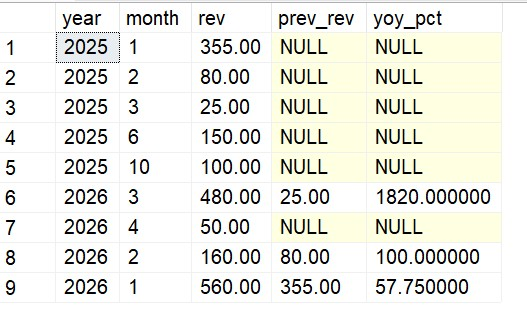

# 📊 Advanced SQL for Strategic Business Intelligence: GlobalMart Star Schema
## Business Scenarios & Advanced SQL Solutions

### Scenario 2: Year-over-Year (YoY) Monthly Sales Growth

#### Business Problem: 
The Finance team needs to track the company's growth trajectory by comparing monthly sales to the exact same month in the previous year.

#### Solution Steps:
1. Aggregate sales by year and month.
2. Use the LAG() window function to fetch sales from 12 months prior.
3. Calculate the percentage growth.

#### Math Formula:
$$\text{YoY Growth \%} = \left( \frac{\text{Current Sales} - \text{Previous Sales}}{\text{Previous Sales}} \right) \times 100$$

---
#### SQL Query

WITH Monthly AS (
    SELECT d.year, d.month, SUM(fs.total_sales) AS rev
    FROM fact_sales fs JOIN dim_date d ON fs.date_id = d.date_id
    GROUP BY d.year, d.month
)
SELECT year, month, rev, LAG(rev, 1) OVER(PARTITION BY month ORDER BY year) AS prev_rev,
ROUND(((rev - LAG(rev, 1) OVER(PARTITION BY month ORDER BY year)) / LAG(rev, 1) OVER(PARTITION BY month ORDER BY year)) * 100, 2) AS yoy_pct
FROM Monthly
ORDER by year;

---

---

####  Thanks for visiting here - Happy Learning ####
