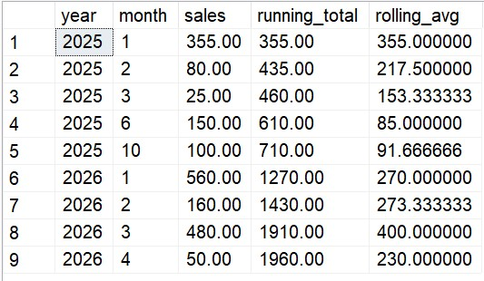

# 📊 Advanced SQL for Strategic Business Intelligence: GlobalMart Star Schema
## Business Scenarios & Advanced SQL Solutions

### Scenario 3: Rolling 3-Month Average & Running Total

#### Business Problem: 
Executives need a smoothed revenue trend to ignore short-term spikes.

#### Solution Steps:
Use window functions with frame specifications to slice accurate rows

#### Math Formula:
Rolling 3-Month Avg= ((Sales) n  + (Sales) n−1  + (Sales) n−2) / 3
​
 
​

---
#### SQL Query

SELECT d.year, d.month, SUM(fs.total_sales) AS sales,
SUM(SUM(fs.total_sales)) OVER (ORDER BY d.year, d.month) AS running_total,
AVG(SUM(fs.total_sales)) OVER (ORDER BY d.year, d.month ROWS BETWEEN 2 PRECEDING AND CURRENT ROW) AS rolling_avg
FROM fact_sales fs JOIN dim_date d ON fs.date_id = d.date_id
GROUP BY d.year, d.month;

---

---

####  Thanks for visiting here - Happy Learning ####
