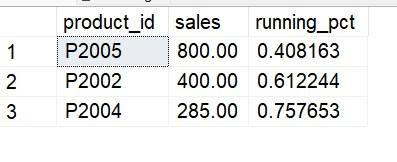
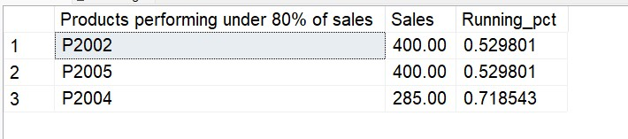
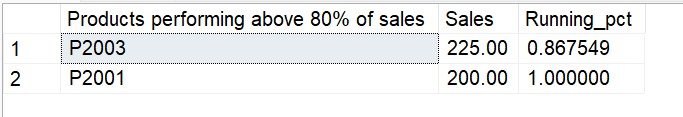

# 📊 Advanced SQL for Strategic Business Intelligence: GlobalMart Star Schema
## Business Scenarios & Advanced SQL Solutions

### Scenario 4: Pareto Principle (80/20 Rule) for Products

#### Business Problem: 
Identify products generating the top 80% of sales.

#### Solution Steps:
Calculate running percentage of revenue across products

#### Math Formula:
Cumulative % = (∑Sales of Top N Products / Total Company Sales)  × 100

---
#### SQL Query

WITH Prod_Sales AS (
    SELECT product_id, SUM(total_sales) AS sales
    FROM fact_sales GROUP BY product_id
),
Cum_Pct AS (
    SELECT product_id, sales,
    SUM(sales) OVER (ORDER BY sales DESC) / SUM(sales) OVER () AS running_pct
    FROM Prod_Sales
)
SELECT * FROM Cum_Pct WHERE running_pct <= 0.85;

---

---

WITH Prod_Sales AS (
    SELECT product_id, SUM(total_sales) AS sales
    FROM fact_sales GROUP BY product_id
),
Cum_Pct AS (
    SELECT product_id, sales,
    SUM(sales) OVER (ORDER BY sales DESC) / SUM(sales) OVER () AS running_pct
    FROM Prod_Sales
)
SELECT product_id as 'Products performing under 80% of sales', Sales, Running_pct FROM Cum_Pct WHERE running_pct <= 0.85;

---

---

WITH Prod_Sales AS (
    SELECT product_id, SUM(total_sales) AS sales
    FROM fact_sales GROUP BY product_id
),
Cum_Pct AS (
    SELECT product_id, sales,
    SUM(sales) OVER (ORDER BY sales DESC) / SUM(sales) OVER () AS running_pct
    FROM Prod_Sales
)
--SELECT product_id as 'Products performing under 80% of sales', Sales, Running_pct FROM Cum_Pct WHERE running_pct <= 0.85;
SELECT product_id as 'Products performing above 80% of sales', Sales, Running_pct FROM Cum_Pct WHERE running_pct >= 0.85;

---

---

####  Thanks for visiting here - Happy Learning ####
