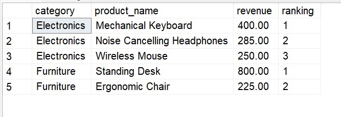

# 📊 Advanced SQL for Strategic Business Intelligence: GlobalMart Star Schema
## Business Scenarios & Advanced SQL Solutions

### Scenario 5: Top 3 Selling Products Per Category

#### Business Problem: 
Category Managers need to see the top 3 items in every product category based on total revenue.

#### Solution Steps:
Partition data by category and rank based on localized revenue

---
#### SQL Query

WITH Ranked_Products AS (
    SELECT 
        p.category, p.product_name, SUM(fs.total_sales) AS revenue,
        DENSE_RANK() OVER (PARTITION BY p.category ORDER BY SUM(fs.total_sales) DESC) AS rank
    FROM fact_sales fs
    JOIN dim_products p ON fs.product_id = p.product_id
    GROUP BY p.category, p.product_name
)
SELECT category, product_name, revenue, rank
FROM Ranked_Products
WHERE rank <= 3;

---

---

####  Thanks for visiting here - Happy Learning ####
