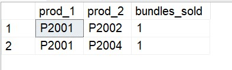

# 📊 Advanced SQL for Strategic Business Intelligence: GlobalMart Star Schema
## Business Scenarios & Advanced SQL Solutions

### Scenario 6: Market Basket Analysis (Product Affinity)

#### Business Problem: 
Which products are frequently bought together? This will help the digital team optimize the "Customers also bought" recommendation engine.

#### Solution Steps:
A self-join on transaction_id brings items from the same receipt together. 
The condition a.product_id < b.product_id ensures we don't match an item with itself and prevents duplicate pairs (e.g., matching A with B and B with A).

---
#### SQL Query

SELECT a.product_id AS prod_1, b.product_id AS prod_2, COUNT(*) AS bundles_sold
FROM fact_sales a
JOIN fact_sales b ON a.transaction_id = b.transaction_id AND a.product_id < b.product_id
GROUP BY a.product_id, b.product_id
ORDER BY bundles_sold DESC;

---

---

####  Thanks for visiting here - Happy Learning ####
