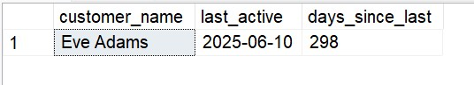

# 📊 Advanced SQL for Strategic Business Intelligence: GlobalMart Star Schema
## Business Scenarios & Advanced SQL Solutions

### Scenario 7: Customer Retention & Churn Identification

#### Business Problem: 
Find at-risk customers who haven't bought anything in 90 days (Current date).

#### Solution Steps:
Filter out customers with maximum transaction dates within the last 90 days.

#### Math Formula:
Days Inactive = Current Date − Max(Purchase Date)

---
#### SQL Query

SELECT
    c.customer_name,
    MAX(d.full_date) AS last_active,
    DATEDIFF(day, MAX(d.full_date), CAST(GETDATE() AS date)) AS days_since_last
FROM fact_sales fs
JOIN dim_customers c ON fs.customer_id = c.customer_id
JOIN dim_date d ON fs.date_id = d.date_id
GROUP BY
    c.customer_name
HAVING
    DATEDIFF(day, MAX(d.full_date), CAST(GETDATE() AS date)) > 90;

---

---

####  Thanks for visiting here - Happy Learning ####
