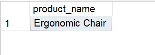
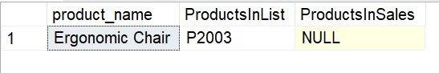

# 📊 Advanced SQL for Strategic Business Intelligence: GlobalMart Star Schema
## Business Scenarios & Advanced SQL Solutions

### Scenario 8: Slow-Moving Inventory Detection

#### Business Problem: 
Find products with zero sales in the last 6 months.

#### Solution Steps:
Left join the products table to sales filtered by a timeframe boundary.

---
#### SQL Query

SELECT p.product_name
FROM dim_products p
LEFT JOIN (
    SELECT DISTINCT product_id
    FROM fact_sales fs
    JOIN dim_date d ON fs.date_id = d.date_id
    WHERE d.full_date >= DATEADD(MONTH, -6, CAST(GETDATE() AS date))
) sales_6m
    ON p.product_id = sales_6m.product_id
WHERE sales_6m.product_id IS NULL;

---

---

SELECT p.product_name, p.product_id as ProductsInList, sales_6m.product_id as ProductsInSales
FROM dim_products p
LEFT JOIN (
    SELECT DISTINCT product_id
    FROM fact_sales fs
    JOIN dim_date d ON fs.date_id = d.date_id
    WHERE d.full_date >= DATEADD(MONTH, -6, CAST(GETDATE() AS date))
) sales_6m
    ON p.product_id = sales_6m.product_id
WHERE sales_6m.product_id IS NULL

---

---

####  Thanks for visiting here - Happy Learning ####
