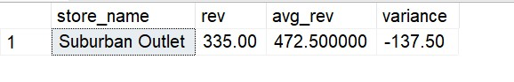

# 📊 Advanced SQL for Strategic Business Intelligence: GlobalMart Star Schema
## Business Scenarios & Advanced SQL Solutions

### Scenario 9: Store Performance vs Regional Average

#### Business Problem: 
Target stores running below localized benchmarks.

#### Solution Steps:
Use standard aggregation matched with a table-wide regional average.

---
#### SQL Query

WITH Store_Rev AS (
    SELECT s.store_name, s.region, SUM(fs.total_sales) AS rev
    FROM fact_sales fs JOIN dim_stores s ON fs.store_id = s.store_id GROUP BY s.store_name, s.region
),
Reg_Avg AS (
    SELECT region, AVG(rev) AS avg_rev FROM Store_Rev GROUP BY region
)
SELECT sr.store_name, sr.rev, ra.avg_rev, (sr.rev - ra.avg_rev) AS variance
FROM Store_Rev sr JOIN Reg_Avg ra ON sr.region = ra.region
WHERE sr.rev < ra.avg_rev;

---

---

####  Thanks for visiting here - Happy Learning ####
