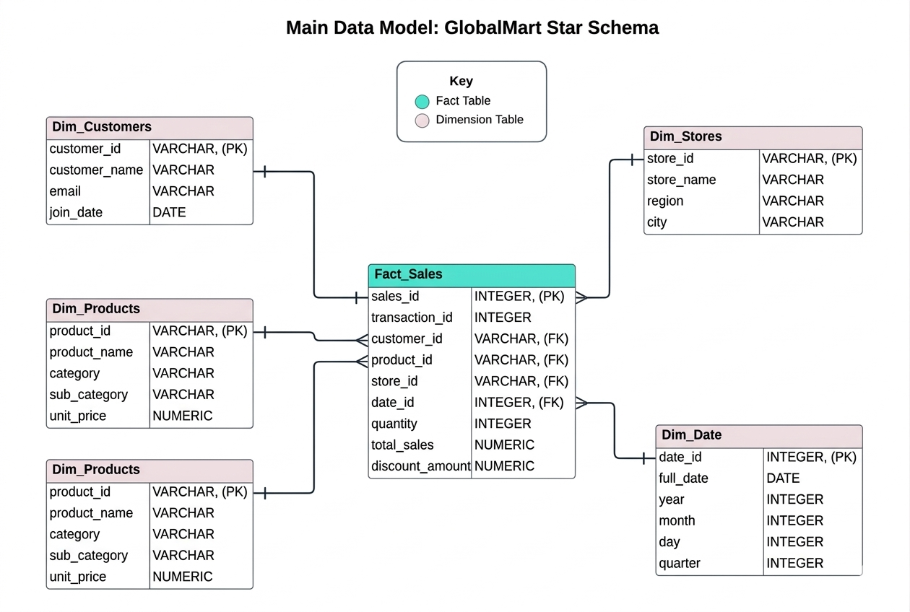

# 📊 Advanced SQL for Strategic Business Intelligence: GlobalMart Star Schema

Welcome to my Advanced SQL Portfolio Project! This repository showcases how raw database data can be transformed into actionable business insights using complex SQL techniques. 

Instead of basic data extraction, this project focuses on **10 real-world business scenarios** across marketing, finance, and operations to drive data-driven decision-making.

---
Project folder structure

📁 sql-portfolio-project/
│
├── 📁 Business Scenarios & Advance SQL Solutions/
│   ├──📁 Images/
│   ├──📁 SQL Queries/
│   ├── Scenario 1
│   ├── Scenario 2
│   └── Scenario 3
│   └── Scenario 4
│   └── Scenario 5
│   └── Scenario 6
│   └── Scenario 7
│   └── Scenario 8
│   └── Scenario 9
│   └── Scenario 10
│
├── 📄 GlobalMart_Schema.sql        <-- Table creation SQL script 
├── 📄 GlobalMart_Seed_Data.sql     <-- Sample Data insertion script 
└── 📄 README.md                    <-- Project overview 

---

## 🗄️ Database Architecture: The GlobalMart Star Schema

To simulate an enterprise-level data warehouse, this project utilizes a highly optimized **Star Schema** centered around an e-commerce retail business. 

### Tables and Cardinalities:
* **`Fact_Sales`** (Central Fact Table): Captures transactional data such as quantity, total sales, and discounts.
* **`Dim_Customers`** (1:N with Fact_Sales): Contains customer demographic and join data.
* **`Dim_Products`** (1:N with Fact_Sales): Contains product names, categories, and prices.
* **`Dim_Stores`** (1:N with Fact_Sales): Contains store locations and regions.
* **`Dim_Date`** (1:N with Fact_Sales): Contains structured date hierarchies for time-series analysis.

---

---

#### 💡 Business Scenarios & Advanced SQL Solutions

Here are 10 distinct business problems I solved, demonstrating advanced techniques like Window Functions, CTEs, Self-Joins, and Cohort Analysis.

> **Note:** The full query scripts and expected output tables can be found in the `/queries` folder of this repository.

### 🎯 1. Customer RFM Segmentation
* **Business Problem:** Marketing needs to identify top, loyal, and at-risk customers.
* **SQL Technique:** `CTE`, `NTILE(5)` window function, string concatenation.
* **Impact:** Enables highly targeted promotional campaigns.

### 📈 2. Year-over-Year (YoY) Monthly Sales Growth
* **Business Problem:** Finance needs to track company growth by comparing monthly sales to the same month last year.
* **SQL Technique:** `LAG()` window function, arithmetic expressions.
* **Impact:** Benchmarks company growth trajectories.

### 🌊 3. Rolling 3-Month Average & Running Total
* **Business Problem:** Executives need a smoothed trendline of sales to evaluate long-term direction.
* **SQL Technique:** `AVG()` with `ROWS BETWEEN 2 PRECEDING AND CURRENT ROW`.
* **Impact:** Filters out short-term seasonal spikes in decision-making.

### ⚖️ 4. Pareto Principle (80/20 Rule) for Products
* **Business Problem:** Identify the top products generating 80% of company revenue.
* **SQL Technique:** Cumulative percentage using window functions.
* **Impact:** Optimizes inventory management and stock priorities.

### 🏆 5. Top 3 Selling Products Per Category
* **Business Problem:** Category Managers need to see top performers in every product line.
* **SQL Technique:** `DENSE_RANK() OVER (PARTITION BY category)`.
* **Impact:** Guides merchandising and website placement strategies.

### 🛒 6. Market Basket Analysis (Product Affinity)
* **Business Problem:** Which products are frequently bought together on the same receipt?
* **SQL Technique:** Self-Join with non-equal conditions (`a.product_id < b.product_id`).
* **Impact:** Powers recommendation engines and product bundling strategies.

### 🚨 7. Customer Retention & Churn Identification
* **Business Problem:** Identify customers who haven't made a purchase in over 90 days.
* **SQL Technique:** `GROUP BY`, `HAVING`, date arithmetic.
* **Impact:** Triggers automated win-back marketing emails.

### 🐢 8. Slow-Moving Inventory Detection
* **Business Problem:** Find products that have generated zero sales in the last 6 months.
* **SQL Technique:** `LEFT JOIN` combined with `WHERE ... IS NULL` checks.
* **Impact:** Prevents capital tie-up in dead stock.

### 📍 9. Store Performance Against Regional Average
* **Business Problem:** Find stores underperforming compared to the average of their own specific region.
* **SQL Technique:** Multiple CTEs, analytical aggregation.
* **Impact:** Highlights localized operational issues.

### 👥 10. Customer Lifetime Value (CLV) Cohort Analysis
* **Business Problem:** Group customers by the year of their first purchase to track spending over time.
* **SQL Technique:** Subqueries, multi-dimensional aggregation.
* **Impact:** Evaluates long-term customer loyalty and ROI.

---

#### 📌 Key Takeaways
This project demonstrates advanced SQL proficiency and a business-focused analytical mindset, enabling the transformation of raw data into strategic, decision-ready insights.

Advanced Analytical Capabilities
By leveraging sophisticated SQL techniques such as window functions, common table expressions (CTEs), and recursive queries, this project uncovers deeper patterns and trends that go beyond surface-level analysis.

Data-to-Value Translation
A total of 10 cross-functional business challenges—spanning operations, customer relationship management, and finance—were addressed, with a strong focus on converting data into actionable and meaningful insights.

Enterprise-Level Data Modeling
Built upon a multi-dimensional star schema, the project reflects best practices in data warehousing, ensuring that queries are not only efficient but also scalable and aligned with real-world enterprise environments.

The Broader Impact
More than a technical exercise, this work highlights the role of data in driving strategic outcomes—demonstrating how well-structured analysis can support decision-makers in achieving sustainable growth and operational efficiency.

---

#####  📌 How to Use
1. Clone this repo or download the `.sql` files.
2. Open MS SQL Server Management Studio and create Database and execute table schema .sql file (create tables and relationships between them) first, then Seed_data.sql file next (sample data) or add your own data.
3. Explore each indivisual Business scenarios.

## 📬 Contact Author
Created by [Usha Topagi]  

####  Thanks for visiting here - Happy Learning ####
