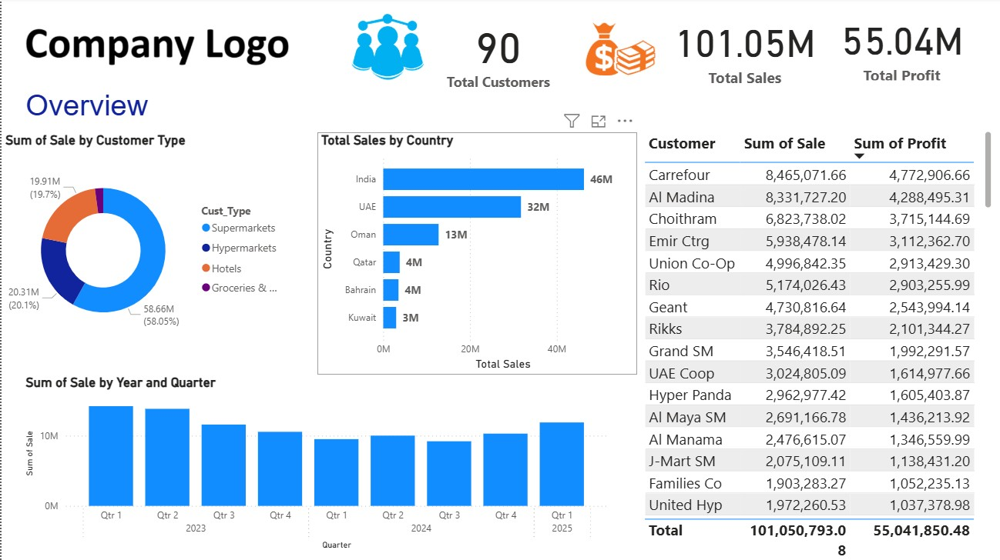

# 📈 Sales Performance Dashboard (Power BI)

## 🔍 Overview
This project presents an interactive Power BI dashboard analyzing sales performance using a fictional dataset. It highlights sales KPIs, regional trends, product categories, and sales by Customer type, product, country, etc.,.

## 📊 Tools Used
- Microsoft Power BI Desktop
- DAX
- Sample CSV data

## 🎯 Features
- KPI cards: Total Sales, Profit, Customers.
- Quarterly and Yearly trend analysis.
- Sales distribution among Customer type.
- Product category insights.
- Sales by Sales Managers contributing to Total Sales.

## 📂 Structure

Sales Data Analysis/
│
├── README.md
├── PowerBI-Report/
│   └── Sales Data Analysis.pbix  
├── Data/
│   └── sales_data.csv
├── Images/
│   └── CompanyLogo.jpg
│   └── Customer.png
│   └── Money.png
├── DAX/
│   └── DAX_Functions_measures.md

## 🖼 Dashboard Preview

## 📌 How to Use
1. Clone this repo or download the `.pbix` file.
2. Open it in Power BI Desktop.
3. Explore the visuals or connect your own data.

## 📬 Contact Author
Created by [Usha Topagi]  
